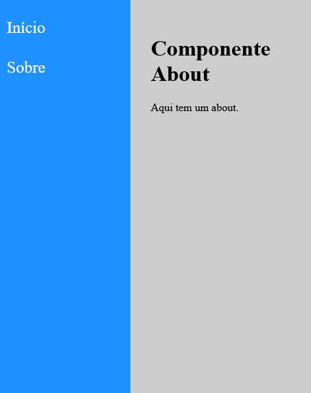

_This README.md file is in English and Portuguese. // Esse arquivo README.md está em Inglês e Português._


# PT: Página de Navegação em React.js: usando React Router

###  _Aplicação simples para aprender e praticar a lib **React Router**._


 ⚠️ _Isso foi criado enquanto eu seguia o projeto de Navegação do curso de React e Redux do Leonardo Moura Leitão. O curso está [disponível na Udemy aqui](https://www.udemy.com/course/react-redux-pt/)_. ⚠️

 Fiz modificações de CSS e adicionei lorem ipsum, além de algumas informações relacionadas a estudos e projetos.

 _Printscreen da versão final abaixo._



## Caderno de Anotações

Fiz uma modificação importante em termos de código.

No curso, é utilizado o seguinte código para trabalhar com as "rotas", no arquivo `Content.jsx`:

```javascript
const Content = props => (
    <main className="Content">
        <Switch>
            <Route path="/about">
                <About />
            </Route>
            <Route path="param/:id">
                <Param />
            </Route>
            <Route path="/">
                <Home />
            </Route>
        </Switch>
    </main>
)
```

Eu tive que trocar o código porque `Switch` não existe mais e o **React acusou erro**. Procurando soluções, encontrei algumas páginas indicando como fazer com a nova sintaxe. 

Troquei o código mencionado acima por este aqui e deu tudo certo:

```javascript
const Content = props => (
    <main className="Content">
        <Routes>
            <Route path="/home" element={ <Home />} />
            <Route path="/param/:id" element={ <Param /> } />
            <Route path="/about" element={ <About /> } />
        </Routes>
    </main>
)
```

_Fim._
